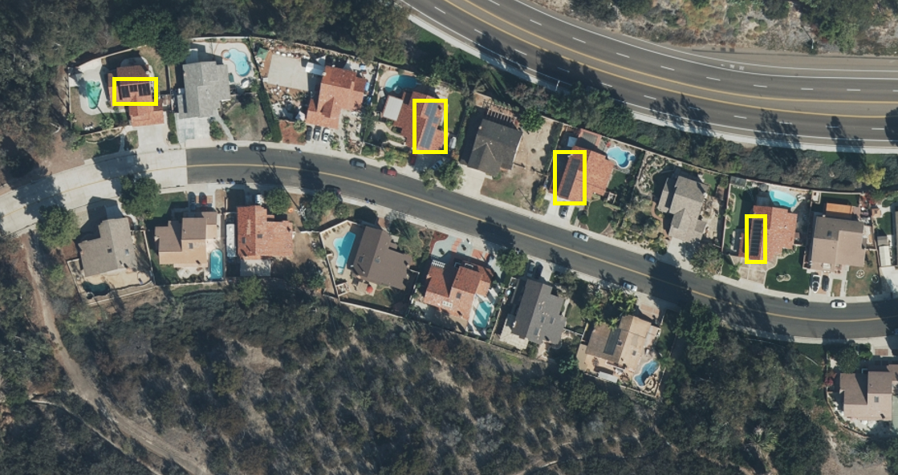
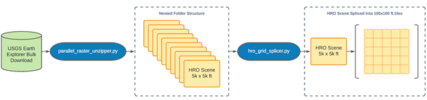
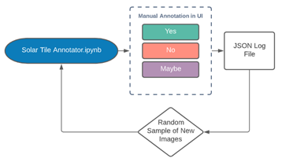
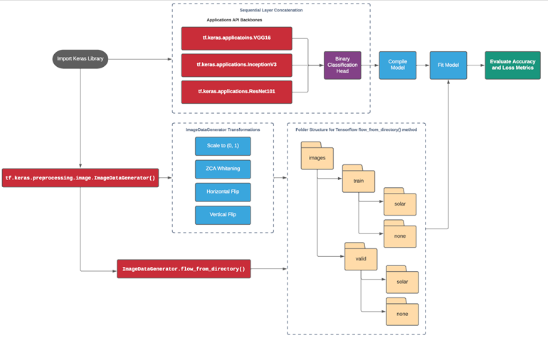
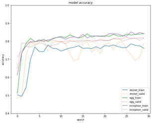
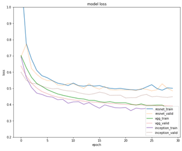
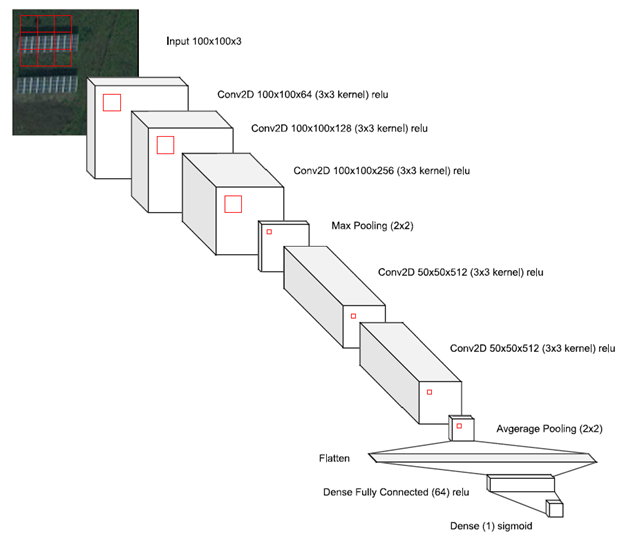
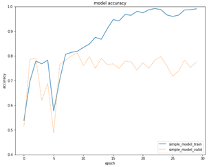
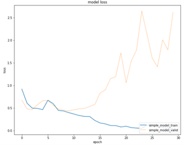

# Automatic Solar PV Panel Image Classification with Deep Neural Network Transfer Learning

## Project Environment Setup

Due to some dependency issues on my local machine, I was not able to build a requirement.txt or environment.yaml file that was clean and usable by others. It is therefore recommended that you build a virtual environment locally with these requirements to ensure that the scripts and notebooks will work without error. This is what worked for me, but feel free to build your environment as works best for you:

**GPU Environment**
 - Processor: Intel® Core™ i7-8750H CPU @ 2.20GHz
 - GPU: NVIDA GeForce RTX 2060
 - RAM: 32gb
 - NVIDIA Driver: v445.87
 - CUDA Toolkit: v10.1
 - Python: 3.6.11

**Primary Dependencies**:
 - notebook
 - tqdm
 - pigeon-jupyter
 - numpy
 - pandas
 - scikit-learn
 - scikit-image
 - gdal
 - rasterio
 - imageio
 - opencv-python
 - tensorflow: **2.3.1**
 - keras-tuner

## Scripts and Notebooks

`parallel_raster_unzipper.py`: script that takes a folder path in the command-line argument, and builds a multiprocessing pool to recursively unzip all of the zipped raster images, and extracts them into their own subfolders.

**Example**: `python parallel_raster_unzipper.py --path ./zipped_hro/`

`hro_grid_splicer.py`: script that performs the grid splicing of HRO images into smaller tiles that can be used for annotation and testing the models developed. The program runs in the command-line terminal, and takes multiple parameters:
 - `inpath`: the full directory path to where the tif files are located
 - `outpath`: full directory path to where the clipped tif files will be stored
 - `width`: allows the user to specify a width of the windows spliced (default 500)
 - `height`: allows the user to specify a height of the windows spliced (default 500)

**Example**: `python hro_grid_splicer.py --inpath ./original_images/ --outpath ./spliced_images --width 100 --height 100`

`image_theme_clustering.py`: script that takes a folder path to spliced tif images (or unspliced either way) and performs k-means clustering on the images based on the contours of each image. The goal of this script was to cluster images into like land use, e.g. grass and trees, roads, or buildings. Based on the clusters determined, the program will create multiple folders for each cluster, and move all images labeled as such into their respective folders. It takes two command-line arguments:
- `--inpath`:  the full directory path to where the tif files are located
- `--n_clusters`: the number of clusters to fit a k-means algorithm on, for example, 2 would yield 2 new folders

**Example**: `python image_theme_clustering.py --inpath ./spliced_images/ --n_clusters 2`

`Ortho Image Analysis.ipynb`: Jupyter notebook used to explore the HRO tif dataset, and performed tasks like image augmentation, building contours, and row-wise pixel value histograms for each color band (RGB + NIR). Also experimented with using PCA to see if there was an explainable variance ratio for a given number of components that could be used in feature extraction for training neural networks.

`Solar Tile Annotator.ipynb`: Jupyter notebook used to label each spliced image tile with either having a solar panel, not having one, or maybe having one. Based on the user interactions with the widget, it will store the recorded annotations into a JSON log file. Every time the user starts the notebook over, it can learn what files have already been annotated from the existing JSON log file, and know to sample images the user hasn't seen before.

`Solar PV Image Classification Deep Learning Models.ipynb`: Jupyter notebook used to train and evaluate the performance of various ConvNet backbones with transfer learning, as well as building a simple 'vanilla' ConvNet. This notebook contains the workflow documented below that includes `tf.keras.preprocessing.image.ImageDataGenerators`, `tf.keras.applications` [VGG16, ResNet101, InceptionV3], and manually building the train and validation sets. At the end of the notebook, you can see the kerastuner library being used, but the parameter space was too large to run locally, as I kept running out of memory.

## Project Summary:

The goal of this project is to leverage state-of-the-art ConvNet backbones to build a simple image classification model that can detect the presence of solar panels in a High Resolution Orthoimage .tif file (HRO). These images are typically in 0.33 meter (or ~1ft) pixel resolution, so an entire 5000x5000 pixel scene is approximately a square mile of surface area. For the sake of having more data than could reasonably be used in the project, I downloaded nearly 1TB of HRO image files across various US geographies primarily from California, but also including New Jersey, Texas, and New York. HRO coverage in the selected urban and rural regions were known to have a high incidence of solar panel installations. All image files were downloaded directly from the USGS EarthExplorer website.

**Figure 1: Sample HRO Image**\

To build an image classification pipeline, the HRO files had to be spliced into smaller tiles that could encapsulate the rooftop surface of a residential building, or a section of a warehouse rooftop displaying all or part of a solar panel installation. An image size of 100x100 pixels was determined to be appropriate becuase it was close enough to see a solar panel and some of the surrounding context, while not grabbing other houses and objects and not being too granular that the human annotator could not determine what an image contains. The annotation process was done by a team of four Northeastern University MSCS students who are members in the NEU AI Affinity Group. As described in more detail below, a Jupyter notebook was used to manually annotate nearly 28,000 spliced tiles that were randomly sampled across Contra Costa County, CA.

Below is a summary of the two workflows for splicing the full-size HRO files, and then annotating them manually using a simple widget in Jupyter:

**Figure 2: Image Splicing Workflow**\

**Figure 3: Image Annotation Workflow**\

Below is a summary of the annotation results in terms of how many images were found to contain a solar panel, and how the images were split up for training and validation purposes when training the different models:

**Annotation Results:**
 - 688 positive images containing solar panels
 - 26,957 negative images without solar panels

**Initial Train/Validation Split:**
 - Training Set:
    - 593 positive
    - 23,238 negative
 - Validation Set:
    - 45 positive
    - 3,669 negative

**Final Train/Validation Split for Keras models:**
 - Training Set:
    - 550 positive
    - 550 negative
 - Validation Set:
    - 138 positive
    - 138 negative

**Final Model Training and Results:**

Finally after annotating nearly 28,000 images, and separating them into folders for model training and validation purposes, I designed a workflow that trained three different high performing ConvNet backbones called from the Keras Applications API. Models leveraged the ImageDataGenerator class to perform tasks like ZCA whiteneing and horizonal/vertial flipping. Each of the backbones were given a simple single dense layer with a sigmoid activation funtion to perform binary classificaoin. See the full workflow diagram below:

**Figure 4: Keras Transfer Learning API Workflow**\

With minimal tuning to the models, they were able to achieve over 80% accuracy and less than 0.5 loss. It was shown that VGG16 had the most consistent convergence between training and validation sets throughout the training process. Below is a comparison of the accuracy and loss metrics for each of the three backbones evaluated:

**Figure 5: Comparison of VGG16, InceptionV3 and ResNet101 Model Performance**\

**Experimental ConvNet Design:**

I also wanted to experiment with a novel design that has a convolutional module that is heavily influenced by other state-of-the-art models, like VGG and ResNet. As you can see below, the architecture has less than a dozen layers, with multiple convolutional layers stacked with either a max or average pooling layer, followed by a flattening and fully connected layer, prior to the sigmoid classification head:

**Figure 6: Simple Experimental ConvNet Architecture**\

Below is a summary of the accuracy and loss performance of the experimental ConvNet model:

**Figure 6: Experimental ConvNet Model Performance**\

